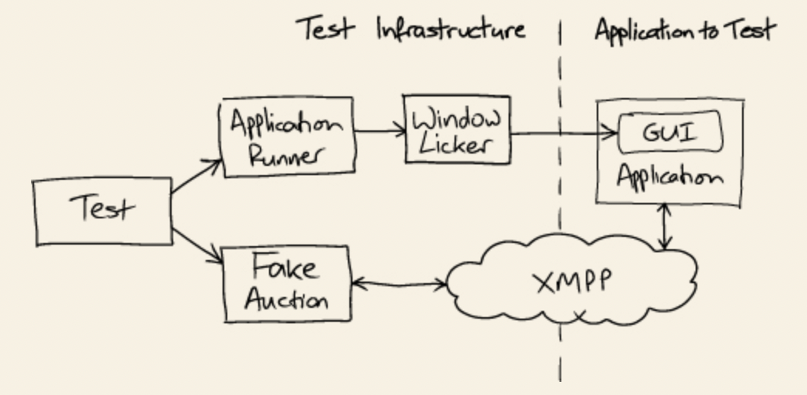
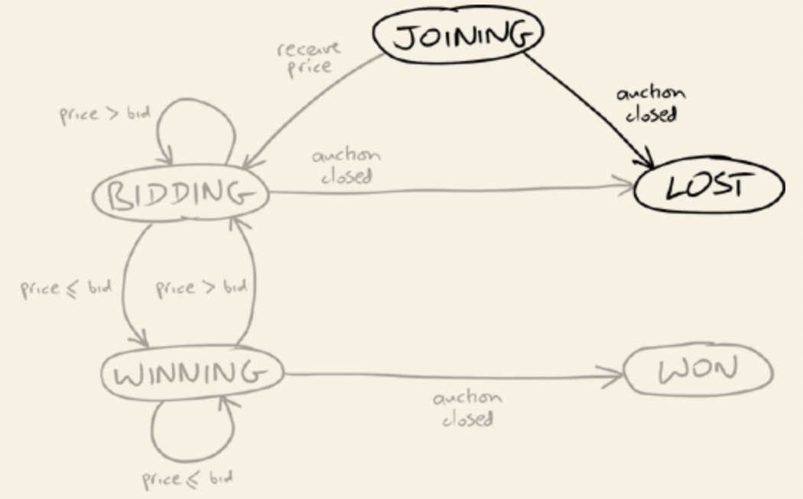

The purpose of this repository is to record my experience while following Steve Freeman's and Nat Pryce's book "Growing Object-Oriented Software Guided by Tests". You can find more information about the book [here](http://www.growing-object-oriented-software.com).

## Setup of the test infrastructure

In order to make the unit tests pass, we first need to create an environment for them to be able to run. And, in order to set the environment for the unit tests to execute, we need to first devise the end-to-end test infrastructure, which, although requires a significant effort, will benefit the project's development in a incremental and iterative way.

In order to provide this end-to-end infrastructure, according to the authors we need to ensure the following:

* Define four components : an XMPP message broker, a stub auction that can communicate over XMPP, a GUI testing framework (for testing the UI of our Sniper Application), and a test harness that can cope with our multithreaded, asynchronous architecture.
* Get the project under version control with an automated build/deploy/test process

Working through the first end-to-end test will force some of the structural decisions we need to make, such as packaging and deployment.

### Package selection

We need an XMPP message broker to let the application talk to the stub auction house (Fake Auction Server). The authors have chosen an open-source implementation called [Openfire](https://www.igniterealtime.org/projects/openfire/) for the server part, and [Smack](https://www.igniterealtime.org/projects/smack/) for its client counterpart (the client library).

The authors have also chosen to use [WindowLicker](https://code.google.com/archive/p/windowlicker/). It supports the requirement of having a high-level test framework that can work with Swing and Smack, both of which are multithreaded and event-driven. However due to its discontinued support, WindowLicker shouldn't be used in a production environment - rather, it should be used as a tool that facilitates support in understanding the testing using the TDD approach.

> **_NOTE:_**
End-to-end testing for event-based systems, such as our Sniper, has to cope with asynchrony. The tests run in parallel with the application and do not know precisely when the application is or isn’t ready. This is unlike unit testing, where a test drives an object directly in the same thread and so can make direct assertions about its state and behavior.
An end-to-end test can’t peek inside the target application, so it must wait to detect some visible effect, such as a user interface change or an entry in a log. The usual technique is to poll for the effect and fail if it doesn’t happen within a given time limit.

In our case, both Swing (UI) and the messaging infrastructure (XMPP client-server architecture) are asynchronous, so using WindowLicker (which polls for values) to drive the Sniper covers the natural asynchrony of our end-to-end testing.

### Ready to start

First, we are interested to test a full slice of the application we want to develop - that is, the Sniper service, which will check the auction house (real environment) for items, place a(multiple) bid(s) under the desired item(s), and while wait until the auction is stopped, increment the bidding price until a stopping point or until the auction is closed. 

The first "end-to-end" slice will be just the use case when the Sniper will connect to the auction server and wait for some time until it closes.

The test we have added `sniperJoinsAuctionUntilAuctionCloses()` isn't really and end-to-end, because it doesn't use the real auction server. Our strategy is to first use the Stub Auction server, make the tests pass, and afterwards use the real environment. 